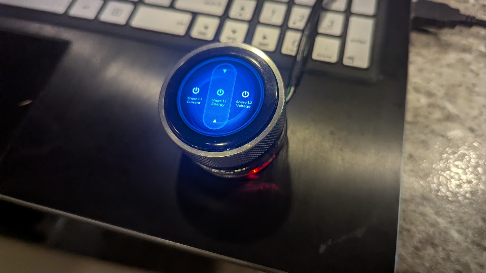
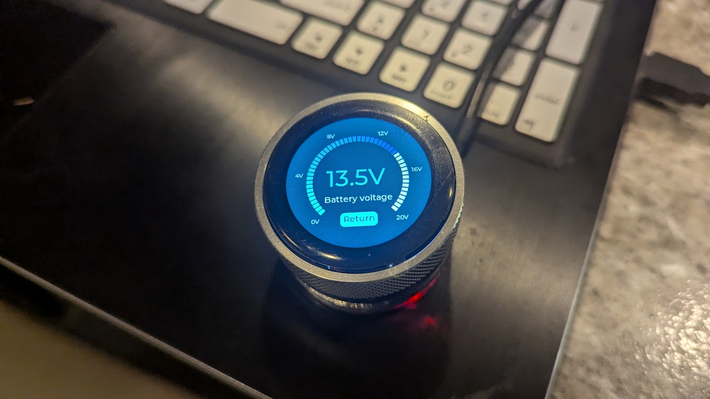
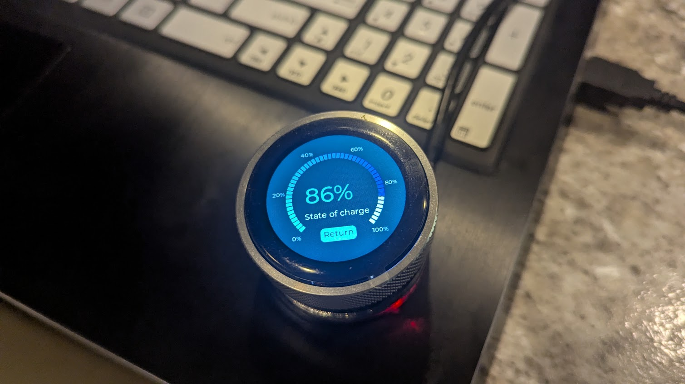

# RV Control UI

RV Control UI is firmware for the Elecrow CrowPanel Advance 1.28-inch Rotary HMI display. It presents locally collected RV telemetry from `rv-control` over MQTT using the existing SquareLine/LVGL visual assets, rotary encoder, touch display, and a local brightness control.

The firmware is intentionally read-only with respect to RV equipment. It subscribes to Renogy telemetry and does not publish MQTT commands or subscribe to `/set` topics.

## Typical Installation

A running display on the bench, showing the carousel and two telemetry detail dials driven by live MQTT data.

| Carousel | Battery voltage | State of charge |
| --- | --- | --- |
|  |  |  |

Rotating the encoder moves the carousel across configured telemetry items; the selected item is centered and its neighbors remain partially visible. Clicking opens the detail dial, whose tick labels and range come from the `arc_min`, `arc_max`, `unit`, and `palette` values in the `catalog` section of `data/config.json`. Double-clicking returns to the carousel.

## Hardware

The project targets the Elecrow CrowPanel Advance HMI ESP32-S3 rotary display:

- ESP32-S3 with 16 MB flash and 8 MB OPI PSRAM.
- 1.28-inch, 240 x 240 round GC9A01 display.
- CST816D capacitive touch controller.
- Rotary encoder with push button.
- USB-C connection for power, serial logging, and firmware upload.

The board wiring is defined in [src/main.cpp](src/main.cpp). The display uses SPI2; touch uses `Wire1` on GPIO 6/7. The encoder uses GPIO 45, GPIO 42, and GPIO 41, while the display backlight is controlled on GPIO 46.

Use a USB-C data cable. A charge-only cable will power the display but cannot upload firmware or expose the serial monitor.

The original factory image can be restored using the instructions in [FLASH_FACTORY_FIRMWARE.md](FLASH_FACTORY_FIRMWARE.md).

## Clone

Clone this repository and enter it:

```sh
git clone https://github.com/triphoppingman/rv-control-ui.git
cd rv-control-ui
```

The project keeps its PlatformIO configuration and local LVGL, LovyanGFX, and SquareLine export under `Arduino/libraries/`; no separate Arduino IDE installation is required.

### VS Code Workspace

The included [rv-control-ui.code-workspace](rv-control-ui.code-workspace) file opens this UI project together with its companion [`rv-control`](https://github.com/triphoppingman/rv-control) collector project. Clone both repositories into the same parent directory before opening the workspace:

```sh
git clone https://github.com/triphoppingman/rv-control-ui.git
git clone https://github.com/triphoppingman/rv-control.git
code rv-control-ui/rv-control-ui.code-workspace
```

The workspace expects `rv-control` at `../rv-control` relative to this repository. It is useful for reviewing the collector's source topics, MQTT payloads, RV-C/CAN tools, and end-to-end configuration while working on the display. PlatformIO builds and uploads for `rv-control-ui` are self-contained and do not require the adjacent checkout.

## Prerequisites

Install PlatformIO Core for your user account. This workspace uses the PlatformIO executable installed in its normal Python environment:

```sh
~/.platformio/penv/bin/pio --version
```

The current configuration uses PlatformIO Core 6. A system `pio` installation may be older or incompatible; use the explicit command above if `pio run` reports a Click or `resultcallback` error.

The device must be able to reach the same local network and MQTT broker used by `rv-control`. Start `rv-control` with its Renogy source enabled before expecting data on the display.

## Configuration

Device configuration is stored in a single file, `/config.json`, on the board's SPIFFS partition. It is not compiled into the firmware. The local configuration image at `data/config.json` is ignored by Git because it contains Wi-Fi and MQTT credentials.

Create it from the tracked template:

```sh
mkdir -p data
cp config-example.json data/config.json
```

Edit `data/config.json` for the local network and broker:

```json
{
	"wifi": {"ssid": "YOUR_WIFI_NETWORK", "password": "YOUR_WIFI_PASSWORD"},
	"mqtt": {"host": "mqtt.local", "port": 1883, "username": "", "password": "", "base_topic": "rv"},
	"display": {"temperature_unit": "F", "expected_poll_interval_seconds": 60, "sleep_after_seconds": 300,
				"show_brightness": true, "show_wifi": true},
	"logging": {"serial_level": "INFO"},
	"catalog": {"sources": [], "palettes": [], "items": []}
}
```

The single file carries both the device settings and the telemetry catalog. The firmware combines `mqtt.base_topic` with the source topic suffixes in the `catalog` section to build each subscription. The whole file is validated at boot and rejected as a unit on any missing, malformed, unknown, or oversized value — the device never attempts a partial network connection.

`display.sleep_after_seconds` controls the backlight timeout after the last touch or encoder activity; `300` is five minutes and `0` keeps the backlight on continuously. `display.show_brightness` and `display.show_wifi` toggle the device-local Brightness and WiFi Info carousel entries. An empty `wifi.ssid` is valid and means "no station network" — the device starts its setup hotspot instead (see below).

Do not commit `data/config.json`, paste its contents into issues, or send it in serial logs. The firmware logs the broker host and MQTT topic but never logs the Wi-Fi SSID or credentials.

## Setup Hotspot

When the device cannot join the configured Wi-Fi network — or `wifi.ssid` is empty — it starts a setup hotspot so it can be configured without a USB cable or PlatformIO.

- **SSID**: `rv-control-ui-XXXX`, where `XXXX` is the last four hexadecimal digits of the device MAC address.
- **Password**: `Password123!`
- **Address**: `192.168.77.1`

Join that network from a phone or laptop, then use the Configuration API below against `http://192.168.77.1`. The hotspot is entered after two consecutive failed 30-second association attempts (about 60 seconds) and exits automatically once the station network connects. While the hotspot is active the MQTT client stays off and the status LED is red.

## Status LED

The onboard NeoPixel strip shows network state on a single dim pixel, visible even when the display backlight has slept:

| Color | State |
| --- | --- |
| Blue | Starting up / connecting to Wi-Fi |
| Orange | Wi-Fi connected, but the MQTT broker is not |
| Green | Fully connected (Wi-Fi and MQTT) |
| Red | Setup hotspot active |

## Configuration API

A minimal HTTP REST API is always exposed — on the hotspot address (`192.168.77.1`) and on the device's normal LAN address — so the configuration can be read and updated without reprogramming via PlatformIO. It is served by the network task and never blocks the display.

| Method | Path | Behavior |
| --- | --- | --- |
| `GET` | `/api/config` | Return the running `config.json`, including the Wi-Fi and MQTT passwords. |
| `POST` | `/api/config` | Validate the body against the full schema, write it to `/config.json` atomically, then restart the device to apply it. |
| `GET` | `/api/info` | Return a debugging snapshot: build date/time, chip model/revision, MAC, uptime, free heap, sketch size, and live network state (hotspot active, Wi-Fi/MQTT connected, SSID, IP, RSSI). |
| `POST` | `/api/restart` | Acknowledge with `200`, then restart the device after a short grace delay. No body required. |

Read the current configuration:

```sh
curl http://192.168.77.1/api/config
```

Read the device status snapshot:

```sh
curl http://192.168.77.1/api/info
```

Replace the configuration (the device restarts to apply it):

```sh
curl -X POST -H "Content-Type: application/json" \
	--data-binary @config-example.json \
	http://192.168.77.1/api/config
```

Restart the device without changing anything:

```sh
curl -X POST http://192.168.77.1/api/restart
```

A `POST /api/config` body must satisfy the same validation used at boot; an invalid body returns `400` with a short error and leaves the on-flash configuration untouched. The API is unauthenticated and returns secrets in plaintext, matching the local-only trust model of the private RV network and its unauthenticated MQTT broker — do not expose the device to an untrusted network.

## Display Catalog

MQTT-backed carousel entries are defined in the `catalog` section of `data/config.json`. The catalog owns allowed source IDs and MQTT topic suffixes, named tick-label/background palettes, telemetry item order, detail title, wrapped carousel label, JSON field name, units, icon, and display arc range. Brightness and Wi-Fi Info remain hardcoded local display functions and are always appended after catalog items.

Define MQTT topics in `sources` and visual colors in `palettes`, then reference their stable IDs from each display item:

```json
{
	"sources": [
		{"id": "charge_controller", "topic": "renogy"}
	],
	"palettes": [
		{"id": "default", "tick_label_color": "#FFFFFF", "display_background": "#000000"},
		{"id": "solar", "tick_label_color": "#F5F7FA", "display_background": "#314633"}
	],
	"items": [
		{
			"title": "PV current",
			"carousel_title": "PV\nCurrent",
			"source": "charge_controller",
			"palette": "solar",
			"value_key": "pv_current",
			"unit": "A",
			"icon": "solar",
			"screen": "electrical",
			"arc_min": 0,
			"arc_max": 50
		}
	]
}
```

Supported icon values are `battery`, `solar`, `load`, and `temperature`. Supported screen values are `electrical` and `temperature`. Every palette requires an `id`; its optional `tick_label_color` and `display_background` values must be `#RRGGBB` when specified and default to `#FFFFFF` and `#000000`, respectively. Use the `default` palette shown above for white-on-black rendering, or define subdued type-specific palettes and assign them by ID. `arc_min` is optional and defaults to `0`; use it with `arc_max` to set the inclusive dial range for a telemetry item. For example, use `"arc_min": -100` and `"arc_max": 100` for a signed battery-current value. Every telemetry detail dial renders six tick labels from its configured range and palette: electrical screens use the item `unit`, while temperature screens use `[display] temperature_unit`. This allows a $90$-$140\text{ V}$ voltage dial, an $0$-$100\%$ state-of-charge dial, or an $0$-$150\text{ F}$ temperature dial without inheriting SquareLine's demonstration labels. The incoming numeric value is rounded to a dial tick and clamped to this range; an unavailable value leaves the dial at its minimum. Brightness and WiFi Info remain local screens with their original visual treatment. Source and palette IDs use letters, numbers, `_`, and `-`; topic suffixes cannot contain MQTT wildcards, whitespace, leading/trailing slashes, or empty levels. Every item `source` and `palette` must name a declared definition. The catalog supports up to eight sources, eight palettes, and 16 entries. An invalid catalog is rejected as a whole and reported over serial at startup.

## Build and Upload

Build the firmware from the project root:

```sh
~/.platformio/penv/bin/pio run
```

Upload the configuration filesystem before the application firmware, and repeat this command whenever `data/config.json` changes:

```sh
~/.platformio/penv/bin/pio run --target uploadfs
```

The same filesystem upload applies the configuration and its catalog section.

Upload the firmware:

```sh
~/.platformio/penv/bin/pio run --target upload
```

Specify a serial port when PlatformIO cannot detect the board automatically:

```sh
~/.platformio/penv/bin/pio run --target upload --upload-port /dev/ttyACM0
```

Open the serial monitor at 115200 baud:

```sh
~/.platformio/penv/bin/pio device monitor --baud 115200
```

At boot, the serial output reports display startup, SPIFFS configuration status, Wi-Fi/MQTT connection attempts, subscription results, telemetry snapshots, and backlight sleep/wake transitions. Repeated network failures are intended to be diagnosable without exposing secrets.

## UI Behavior

The user interaction follows the working RotaryScreen demonstration:

- Turn the encoder to move through individual telemetry values.
- Click the encoder to open the selected detail display.
- Double-click to return to the carousel.
- The brightness item remains locally adjustable; all Renogy measurements are read-only.
- Touch input is provided to LVGL and also wakes the display backlight.

The current SquareLine export provides the round-screen backgrounds, carousel selection treatment, electrical and temperature detail views, and brightness control. The firmware adapts those existing assets as it expands the Renogy browser rather than replacing them with a new widget style.

## Developer Notes

The contents of `Arduino/`, including the RotaryScreen reference sketch, bundled display libraries, and SquareLine project assets, originated from Elecrow's [CrowPanel 1.28-inch HMI ESP32 Rotary Display repository](https://github.com/Elecrow-RD/CrowPanel-1.28inch-HMI-ESP32-Rotary-Display-240-240-IPS-Round-Touch-Knob-Screen). Refer to Elecrow's [device wiki](https://www.elecrow.com/wiki/CrowPanel_1.28inch-HMI_ESP32_Rotary_Display.html) for hardware documentation and vendor guidance. These materials are retained here as the hardware and UI foundation for this firmware.

Source-owned application code lives in `src/`. [Arduino/RotaryScreen_1_28/RotaryScreen_1_28.ino](Arduino/RotaryScreen_1_28/RotaryScreen_1_28.ino) remains the proven hardware and interaction reference, but PlatformIO builds [src/main.cpp](src/main.cpp), not the `.ino` sketch.

SquareLine project source is under `Arduino/ui_project/`; its generated export used for builds is under `Arduino/libraries/UI/`. Edit the SquareLine project, export LVGL 9 code, then deliberately synchronize the generated output. Avoid untracked manual edits to generated files.

`NetworkController` runs all networking — Wi-Fi station/hotspot, MQTT, the configuration REST API, and the NeoPixel status LED — in a dedicated FreeRTOS task. It never calls LVGL. The Arduino `loop()` owns LVGL updates and copies the latest parsed snapshot from the networking task. Keep that separation when adding values, status indicators, or reconnect logic.

Run this before sending a change for review:

```sh
~/.platformio/penv/bin/pio run
```

See [UI_STEERING.md](UI_STEERING.md) for the intended Renogy data model, carousel order, MQTT contract, configuration rules, and definition of done.

## Architecture and Operations

### System Topology

RV Control UI is the display endpoint of a local, read-only telemetry system. It does not attach to the RV-C bus, a Renogy Bluetooth device, or a Hughes device itself. The companion [`rv-control`](../rv-control/README.md) service performs that hardware-facing collection, publishes JSON snapshots to the local MQTT broker, and this ESP32-S3 subscribes over Wi-Fi to render the most recent valid values.

```text
RV-C CAN bus -----\
Renogy BLE --------> rv-control host --> local MQTT broker --> Wi-Fi --> CrowPanel UI
Hughes BLE -------/       (collector)       (for example, Mosquitto)      (ESP32-S3)
```

This separation is intentional. The Linux host owns CAN and Bluetooth access, reconnect policy for those devices, and source polling. The display remains a small MQTT client with no RV hardware-control path. It subscribes only to the catalog-defined telemetry topics; it publishes no commands and does not subscribe to `/set` topics.

For the shipped catalog, the collector publishes `rv/renogy` and `rv/hughes`, while the display combines `[mqtt] base_topic` with catalog source topics `renogy` and `hughes`. A source topic must agree with the collector's configured source topic. A mismatch can leave the display connected to MQTT while all telemetry values remain `--`.

### Firmware Construction

PlatformIO compiles [`src/main.cpp`](src/main.cpp) as the application entry point. The hardware setup follows Elecrow's known-good RotaryScreen demonstration, while application code adds configuration loading, MQTT telemetry, catalog-driven presentation, and display sleep behavior.

At startup, `setup()` performs these operations in order:

1. Starts USB CDC serial logging at 115200 baud.
2. Mounts SPIFFS and validates the unified `/config.json` (settings and catalog together).
3. Initializes the board power pins, GC9A01 display, DMA, LVGL, CST816D touch controller, backlight PWM, and encoder input queue.
4. Starts the network task, which brings up Wi-Fi (or the setup hotspot), the configuration API, the status LED, and MQTT.

The carousel appends enabled local Brightness and WiFi Info entries after catalog entries. Both controls default to enabled and can be hidden independently with `show_brightness` or `show_wifi` in `data/config.json`. If the configuration or its catalog is invalid, enabled local entries still make the display usable for basic diagnostics and the configuration API and hotspot remain available for repair, but MQTT-backed entries are unavailable.

The runtime deliberately has three ownership domains:

| Domain | Owner | Responsibilities | Must not do |
| --- | --- | --- | --- |
| UI and display | Arduino `loop()` | LVGL timers, screen changes, labels, arcs, backlight sleep, and applying telemetry copies | Block on Wi-Fi/MQTT or accept cross-task LVGL calls |
| Rotary input | `encoderTask` FreeRTOS task and the button ISR | Quadrature sampling, debounce, single/double-click classification, and posting `EncoderAction` values to a queue | Touch LVGL objects directly |
| Network | `NetworkController` FreeRTOS task | Wi-Fi station/hotspot, MQTT reconnects, subscriptions, the configuration REST API, the status LED, and bounded JSON parsing | Touch LVGL or send equipment commands |

`loop()` is the sole owner of LVGL objects. The MQTT task copies its newest catalog-indexed `TelemetrySnapshot` through a short critical section; the loop takes a copy and refreshes an active detail view. Preserve this boundary when adding status indicators, new telemetry, or reconnect behavior. Calling LVGL from an MQTT callback or FreeRTOS task will introduce display races and instability.

The display uses two full 240 x 240 RGB565 render buffers in OPI PSRAM and transfers them over SPI2 using LovyanGFX DMA. The selected PlatformIO board settings match the CrowPanel N16R8 configuration: 16 MB flash and 8 MB OPI PSRAM. Do not casually change the memory type, PSRAM flags, display pin assignments, SPI host, DMA configuration, or partition table; they are hardware-specific parts of the working display path.

### Configuration and Data Files

The project has both build-time files in the repository and runtime files uploaded to SPIFFS. These are different operations.

| File | Purpose | When to change it | Required follow-up |
| --- | --- | --- | --- |
| [`platformio.ini`](platformio.ini) | Board target, flash/PSRAM settings, SPIFFS filesystem, local Arduino library path, and external dependencies | Only for intentional build or board changes | Run a firmware build and upload firmware when needed |
| [`partitions.csv`](partitions.csv) | Two OTA firmware slots, a 256 KiB SPIFFS partition, and coredump storage | Only when a partition layout change is explicitly needed | Erase/reflash as appropriate; verify the new layout carefully |
| [`config-example.ini`](config-example.ini) | Safe, tracked template for device configuration | When the runtime configuration schema changes | Update the local `data/config.ini`, then upload SPIFFS |
| `data/config.ini` | Device-local Wi-Fi, MQTT, display, and logging settings; ignored by Git | Per device or network | `~/.platformio/penv/bin/pio run --target uploadfs` |
| [display-catalog-example.json](display-catalog-example.json) | Safe, tracked template for catalog sources, visual palettes, and carousel items | When the catalog schema or generic example changes | Copy it to `data/display-catalog.json` before editing for a device |
| `data/display-catalog.json` | Device-local MQTT source topics, visual palettes, and ordered carousel items; ignored by Git | When changing sources, palettes, or displayed telemetry for a device | `~/.platformio/penv/bin/pio run --target uploadfs` |
| [`src/config_loader.cpp`](src/config_loader.cpp) | Strict bounded INI parser and defaults | When adding a supported configuration key | Update the template and upload a new filesystem image |
| [`src/display_catalog.cpp`](src/display_catalog.cpp) | Strict catalog parser and item limits | When extending catalog schema or validation | Update catalog documentation and upload a new filesystem image |
| [`src/mqtt_telemetry.cpp`](src/mqtt_telemetry.cpp) | Wi-Fi/MQTT lifecycle, allowed topics, JSON validation, and snapshot updates | When changing transport or supported fields | Build and upload firmware |
| [`Arduino/`](Arduino/) | Elecrow-derived hardware reference, libraries, and SquareLine source/export | Only through deliberate hardware or SquareLine work | Preserve the upstream-derived assets and validate the display |

`data/config.ini` is device-local and must not be committed or shared because it contains Wi-Fi and possibly MQTT credentials. Begin with `config-example.ini`; do not put real credentials into documentation, issue reports, or serial logs.

The configuration parser rejects malformed syntax, unrecognized keys, oversized values, missing Wi-Fi SSID, missing MQTT host, and missing MQTT base topic. This is preferable to silently connecting with partial settings. It defaults MQTT port to `1883`, expected poll interval to `60`, sleep timeout to `300`, temperature unit to `F`, and serial level to `INFO` only when those optional values are omitted. The former `renogy_topic` and `hughes_topic` keys are ignored only as a migration compatibility measure; new configuration must define no source topics.

The catalog is also all-or-nothing. It accepts one through eight unique `sources`, one through eight unique `palettes`, then up to 16 entries. Each source requires a unique `id` and MQTT `topic`; each palette requires a unique `id` and may override the default tick-label and background colors; every item requires `title`, `carousel_title`, `source`, `palette`, `value_key`, `unit`, `icon`, and `screen`, and must reference declared source and palette IDs. An invalid catalog produces a serial error and is not partially applied.

Changing a file under `data/` does not change the running display until the SPIFFS image is uploaded. A normal `pio run --target upload` uploads only application firmware; use `pio run --target uploadfs` after each `data/config.ini` or `data/display-catalog.json` change, then reset the board if it does not reboot automatically.

### MQTT Contract and Telemetry Limits

The display builds one subscription for each catalog source as `<base_topic>/<source.topic>`, normalizing the base topic's accidental trailing slash. It accepts only those exact topics. Each MQTT payload must be a JSON object no larger than 1024 bytes. Empty, oversized, malformed, non-object, unexpected-topic, nonnumeric, and non-finite values are ignored rather than displayed.

The firmware has no Renogy- or Hughes-specific field mapping. For a valid catalog source, it extracts each catalog item's `value_key` as a numeric JSON property and stores it at that item's bounded cache index. Add a displayable numeric field by adding or changing a catalog item and uploading SPIFFS; no C++ change is needed unless the payload or presentation needs a new data type or behavior.

Partial messages are expected because device types expose different data. The UI renders an unavailable field as `--` while retaining other valid values from the latest snapshot. The display has no retained-history database: after power-up it waits for a valid new MQTT message. Configure the collector to poll and publish at the interval expected by the display, and consider MQTT retained messages only after deciding that stale data at boot is acceptable for the installation.

Wi-Fi association retries at most every 20 seconds. Once Wi-Fi is available, MQTT reconnect attempts occur at most every 5 seconds. The interface remains interactive through those retries because they run in the network task, not in the UI loop.

### USB Serial Diagnostics

The USB-C connection is a USB CDC serial interface and power/upload path. Use a USB-C data cable; charge-only cables can power the display but will not expose a serial device or accept uploads. This serial connection is for diagnostics, firmware upload, and SPIFFS upload. It is not an RV-C, CAN, RS-485, or equipment-control bus.

Open the monitor from the project root:

```sh
~/.platformio/penv/bin/pio device monitor --baud 115200
```

When automatic port discovery fails, first identify the device with `~/.platformio/penv/bin/pio device list`, then pass the discovered Linux device explicitly:

```sh
~/.platformio/penv/bin/pio device monitor --port /dev/ttyACM0 --baud 115200
```

Close the serial monitor before an upload if it holds the port open. Use the same explicit port with `--upload-port` when necessary. On boot, a healthy sequence includes messages similar to:

```text
[INFO] RV Control UI booting
[INFO] Configuration loaded; MQTT host=... base topic=...
[INFO] Loaded ... telemetry display definitions
[INFO] Wi-Fi connected; RSSI=...dBm IP=...
[INFO] MQTT subscribed to ... catalog source topics
[INFO] Telemetry snapshot ... received
```

The firmware intentionally never logs Wi-Fi credentials. Treat broker hostnames, topic names, IP addresses, and device-identifying client details in logs as installation information and redact them before sharing public reports.

To observe the MQTT side from the collector host or broker host, use a read-only subscription such as:

```sh
mosquitto_sub -h mqtt.local -t 'rv/#' -v
```

Replace `mqtt.local` and `rv` with the configured broker and base topic. This confirms what the display should receive without connecting the display to an RV serial bus. For RV-C/CAN diagnostics, use the tools and SocketCAN interface documented in the companion [`rv-control`](../rv-control/README.md) repository; keep that hardware work on the collector host.

### Things to Watch For

- Keep the display read-only. Do not add MQTT publishing, `/set` subscriptions, CAN writes, BLE writes, or hardware control paths unless that is an intentional, separately reviewed change.
- `loop()` owns LVGL. Encoder, touch interrupt, Wi-Fi, MQTT, and any future background task may queue actions or share copied data, but must not call LVGL APIs.
- Upload SPIFFS after editing either runtime file under `data/`. The most common configuration surprise is flashing a new application while the board still has an old filesystem image.
- Keep catalog source `topic` values synchronized with source `topic` values and MQTT `base_topic` in the companion collector. A connected MQTT client with no snapshots usually indicates a topic, broker, payload, or publisher problem rather than a rendering problem.
- Preserve the 1024-byte MQTT limit. Expanding source payloads beyond it requires a deliberate firmware change and memory review; do not raise the limit casually on a constrained device.
- A changed catalog may be valid JSON but still be rejected if it has duplicate or invalid sources/palettes, an item referencing an unknown source/palette, malformed palette colors, too many sources/palettes/items, missing strings, an `arc_min` below `-5000`, an `arc_min` greater than or equal to `arc_max`, an `arc_max` above `5000`, precision above three decimals, or an unsupported font size. Check serial output after every catalog upload.
- Use `arc_min` and `arc_max` to make the ring meaningful for the measured quantity, such as $90$-$140\text{ V}$ for shore voltage. All telemetry dials use six palette-colored labels derived from their catalog ranges. WiFi Info remains a separate local $0$-$100\%$ RSSI display, and Brightness retains its generated control.
- New numeric values require only a catalog item with a declared source and matching `value_key`. A missing or nonnumeric JSON property displays `--`.
- Do not manually edit generated files under `Arduino/libraries/UI/` as a normal workflow. Update the SquareLine source under `Arduino/ui_project/`, export LVGL 9 code, and deliberately synchronize the generated output.
- The backlight sleep timer turns off PWM only; it does not stop LVGL, erase the current UI, or restart networking. Touch or encoder input restores the selected brightness immediately. Set `sleep_after_seconds = 0` to disable automatic sleep.
- `show_brightness = 0` hides the Brightness entry but does not disable the configured backlight sleep behavior. `show_wifi = 0` hides the WiFi Info entry but does not disable Wi-Fi or MQTT. Both settings default to `1` and reject values other than `0` or `1`.
- Do not change the board memory flags, partitions, touch/encoder/display pins, or display DMA setup while diagnosing an MQTT problem. Those settings are unrelated to broker connectivity and can obscure the original failure.

### Troubleshooting

**The board is powered but does not appear as a serial port.** Confirm that the cable supports data, reconnect directly rather than through an unreliable hub, and run `pio device list`. The firmware enables USB CDC on boot through the PlatformIO build flags. If no device appears after replacing the cable and reconnecting, follow Elecrow's [device wiki](https://www.elecrow.com/wiki/CrowPanel_1.28inch-HMI_ESP32_Rotary_Display.html) and, if needed, restore the stock image using [FLASH_FACTORY_FIRMWARE.md](FLASH_FACTORY_FIRMWARE.md).

**The serial log reports `/config.ini is missing`, an invalid size, malformed syntax, or an invalid setting.** Copy [`config-example.ini`](config-example.ini) to `data/config.ini`, confirm that all section/key names are spelled exactly as shown, and upload the filesystem image. The parser does not ignore unknown keys, and all values must fit its fixed bounds. Ensure the file is below 4096 bytes.

**The serial log reports `SPIFFS mount failed`.** Confirm that [`partitions.csv`](partitions.csv) remains selected by [`platformio.ini`](platformio.ini), rebuild, and upload both the filesystem and firmware. A board previously flashed with an incompatible partition layout may need a careful erase/reflash procedure; preserve any required device-local configuration before doing that.

**The carousel has only Brightness and WiFi Info, or the log says the display catalog is unavailable.** Validate local `data/display-catalog.json` as JSON, verify its `sources` and `items` arrays are nonempty, and confirm every item `source` refers to a declared source ID. Recreate it from [display-catalog-example.json](display-catalog-example.json) if needed, customize it for the collector, and upload SPIFFS after correcting it. The catalog must be under 8192 bytes and contain no more than eight sources and 16 telemetry entries.

**Wi-Fi never connects.** Verify `ssid` and `password` in local `data/config.ini`, use a 2.4 GHz network compatible with the ESP32-S3, and review the periodic `Connecting to Wi-Fi` status in the serial monitor. The firmware retries every 20 seconds. The WiFi Info carousel screen shows connection state, RSSI, SSID, and assigned IP when connected.

**Wi-Fi connects but MQTT fails.** Verify `host`, `port`, and optional credentials; then test the broker from another machine on the same network. The serial log prints an MQTT client state code on failure and retries every 5 seconds. Check firewall rules, broker listener bindings, TLS expectations (this firmware's current client setup is plain MQTT), and that the display can resolve the configured hostname.

**MQTT subscribes but values remain `--`.** Use `mosquitto_sub` to confirm the actual published topics and payloads. Compare the display's `base_topic` and catalog source `topic` values with the companion collector configuration. Confirm that each payload is a JSON object below 1024 bytes and that an item's `value_key` matches a numeric property in its source payload. A valid payload that omits a particular field leaves only that value unavailable.

**The display shows stale or no initial telemetry after reboot.** The UI stores only the last snapshot received while it is running. Verify the collector is still polling and publishing, check its `poll_interval`, and wait for the next message. Retained MQTT messages can make a value available immediately after boot, but decide explicitly whether their potential staleness is appropriate for the RV.

**The screen is black after it was working.** Rotate the encoder, press its button, or touch the screen to wake the backlight. If it remains black, confirm `sleep_after_seconds`, then check serial startup output and the display hardware path before altering network settings. A failed PSRAM allocation logs `LVGL buffer allocation failed` and prevents normal rendering.

**Encoder or touch behavior is missing or erratic.** Start from the known-good pin and initialization sequence in [`src/main.cpp`](src/main.cpp) and the Elecrow-derived [`Arduino/RotaryScreen_1_28/RotaryScreen_1_28.ino`](Arduino/RotaryScreen_1_28/RotaryScreen_1_28.ino) reference. Do not move input processing into the MQTT task or invoke LVGL from the button interrupt.

**Firmware or filesystem upload fails.** Stop the serial monitor, specify the correct `--upload-port`, and verify the ESP32-S3 target and 16 MB flash configuration in [`platformio.ini`](platformio.ini). Build first with `~/.platformio/penv/bin/pio run`. For recovery to the vendor demo, use the documented, address-specific steps in [FLASH_FACTORY_FIRMWARE.md](FLASH_FACTORY_FIRMWARE.md) rather than guessing flash offsets.