# Icon Reference

## Scope

This reference lists every icon-like resource immediately available to firmware
in the current build. It separates two distinct sources:

- LVGL symbol macros, rendered as text with a FontAwesome-compatible LVGL font.
- Image assets already generated and compiled into `Arduino/libraries/UI/`.

## Catalog Icon Literals

For a telemetry catalog item, `icon` accepts exactly one of these strings:

| JSON value | Current carousel visual | Example |
| --- | --- | --- |
| `battery` | `LV_SYMBOL_BATTERY_FULL` | `"icon": "battery"` |
| `solar` | `LV_SYMBOL_CHARGE` | `"icon": "solar"` |
| `load` | `LV_SYMBOL_POWER` | `"icon": "load"` |
| `temperature` | Generated temperature bitmap (`ui_img_icon_temp_601_png` / `ui_img_icon_temp_602_png`) | `"icon": "temperature"` |

`brightness` and `wifi` are device-local carousel entries. They are configured
through `display.show_brightness` and `display.show_wifi`, not through a
catalog item's `icon` field.

Do **not** put an LVGL macro or an image declaration in `config.json`. For
example, `"icon": "LV_SYMBOL_WARNING"` and
`"icon": "ui_img_icon_temp_601_png"` are invalid configuration values. The
parser rejects any value other than the four strings above.

## LVGL Symbols

Use an LVGL symbol with `lv_label_set_text()`, for example:

```cpp
lv_label_set_text(label, LV_SYMBOL_WIFI);
```

The built-in symbols are monochrome glyphs. Their color and size come from the
label's normal LVGL text style. They are suitable for compact status and
carousel symbols, but do not replace a dedicated RV illustration.

| Macro | Meaning | RV UI use |
| --- | --- | --- |
| `LV_SYMBOL_BULLET` | Bullet | List marker or compact status point |
| `LV_SYMBOL_AUDIO` | Audio | Audio or entertainment status |
| `LV_SYMBOL_VIDEO` | Video | Video or camera status |
| `LV_SYMBOL_LIST` | List | Menu or item list |
| `LV_SYMBOL_OK` | Check | Healthy/complete state |
| `LV_SYMBOL_CLOSE` | Close | Dismiss/close control |
| `LV_SYMBOL_POWER` | Power | DC load, inverter, or generic power |
| `LV_SYMBOL_SETTINGS` | Gear | Configuration entry |
| `LV_SYMBOL_HOME` | Home | RV/home overview |
| `LV_SYMBOL_DOWNLOAD` | Download | Receive/import action |
| `LV_SYMBOL_DRIVE` | Drive | Storage or attached drive |
| `LV_SYMBOL_REFRESH` | Refresh | Reconnect/reload action |
| `LV_SYMBOL_MUTE` | Muted speaker | Audio muted state |
| `LV_SYMBOL_VOLUME_MID` | Medium speaker | Medium audio level |
| `LV_SYMBOL_VOLUME_MAX` | Loud speaker | High audio level |
| `LV_SYMBOL_IMAGE` | Image | Artwork/media placeholder |
| `LV_SYMBOL_TINT` | Water drop | Water/tank-related placeholder |
| `LV_SYMBOL_PREV` | Previous track | Previous item |
| `LV_SYMBOL_PLAY` | Play | Start/resume action |
| `LV_SYMBOL_PAUSE` | Pause | Pause action |
| `LV_SYMBOL_STOP` | Stop | Stop action |
| `LV_SYMBOL_NEXT` | Next track | Next item |
| `LV_SYMBOL_EJECT` | Eject | Eject/remove action |
| `LV_SYMBOL_LEFT` | Left chevron | Back/previous navigation |
| `LV_SYMBOL_RIGHT` | Right chevron | Forward/next navigation |
| `LV_SYMBOL_PLUS` | Plus | Increase/add control |
| `LV_SYMBOL_MINUS` | Minus | Decrease/remove control |
| `LV_SYMBOL_EYE_OPEN` | Open eye | Visible/show state |
| `LV_SYMBOL_EYE_CLOSE` | Closed eye | Hidden/masked state |
| `LV_SYMBOL_WARNING` | Warning triangle | Fault or threshold warning |
| `LV_SYMBOL_SHUFFLE` | Shuffle | Shuffle/random action |
| `LV_SYMBOL_UP` | Up chevron | Increase/up navigation |
| `LV_SYMBOL_DOWN` | Down chevron | Decrease/down navigation |
| `LV_SYMBOL_LOOP` | Loop | Repeat/cycle state |
| `LV_SYMBOL_DIRECTORY` | Folder | Browse/configuration group |
| `LV_SYMBOL_UPLOAD` | Upload | Send/export action |
| `LV_SYMBOL_CALL` | Phone | Phone/connectivity state |
| `LV_SYMBOL_CUT` | Scissors | Cut action |
| `LV_SYMBOL_COPY` | Copy | Copy action |
| `LV_SYMBOL_SAVE` | Save | Save action |
| `LV_SYMBOL_BARS` | Bars | Menu or signal-like placeholder |
| `LV_SYMBOL_ENVELOPE` | Envelope | Message/notification |
| `LV_SYMBOL_CHARGE` | Lightning bolt | Solar/charging/current power |
| `LV_SYMBOL_PASTE` | Paste | Paste action |
| `LV_SYMBOL_BELL` | Bell | Notification/alert |
| `LV_SYMBOL_KEYBOARD` | Keyboard | Text input |
| `LV_SYMBOL_GPS` | Crosshairs | GPS/location state |
| `LV_SYMBOL_FILE` | File | File/document |
| `LV_SYMBOL_WIFI` | Wi-Fi | Wi-Fi connectivity |
| `LV_SYMBOL_BATTERY_FULL` | Full battery | Battery high/full |
| `LV_SYMBOL_BATTERY_3` | Three-quarter battery | Battery approximately 75 percent |
| `LV_SYMBOL_BATTERY_2` | Half battery | Battery approximately 50 percent |
| `LV_SYMBOL_BATTERY_1` | Low battery | Battery approximately 25 percent |
| `LV_SYMBOL_BATTERY_EMPTY` | Empty battery | Battery depleted/critical |
| `LV_SYMBOL_USB` | USB | USB connection |
| `LV_SYMBOL_BLUETOOTH` | Bluetooth | Bluetooth connection |
| `LV_SYMBOL_TRASH` | Trash can | Delete action |
| `LV_SYMBOL_EDIT` | Edit | Edit/configure action |
| `LV_SYMBOL_BACKSPACE` | Backspace | Delete input character |
| `LV_SYMBOL_SD_CARD` | SD card | Removable storage |
| `LV_SYMBOL_NEW_LINE` | Return arrow | New-line/enter action |
| `LV_SYMBOL_DUMMY` | Invalid placeholder | Internal LVGL placeholder; do not show |

The canonical macro list is maintained by bundled LVGL in
`Arduino/libraries/lvgl/src/font/lv_symbol_def.h`.

## Exported SquareLine Images

These image declarations are immediately usable through `ui.h`. They are the
only bitmap assets compiled into the current firmware.

| Preview | Declaration | Export asset | Intended visual |
| --- | --- | --- | --- |
| 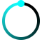 | `ui_img_power_on_progress_60px_png` | `power_on_progress_60px.png` | Boot progress graphic |
| 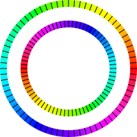 | `ui_img_power_on_light_400_250707_png` | `power_on_light_400_250707.png` | Boot light graphic |
| 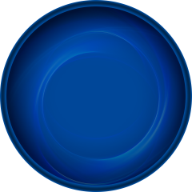 | `ui_img_device_control_bj_01_png` | `device_control_bj_01.png` | Control-screen background |
|  | `ui_img_device_control_select_02_png` | `device_control_select_02.png` | Selected control treatment |
|  | `ui_img_icon_volume_601_png` | `icon_volume_601.png` | Unselected volume/power-like carousel icon |
|  | `ui_img_icon_volume_602_png` | `icon_volume_602.png` | Selected volume/power-like carousel icon |
|  | `ui_img_icon_volume_40_png` | `icon_volume_40.png` | Volume/power detail icon |
|  | `ui_img_icon_light_601_png` | `icon_light_601.png` | Unselected brightness carousel icon |
|  | `ui_img_icon_light_602_png` | `icon_light_602.png` | Selected brightness carousel icon |
|  | `ui_img_750753901` | `icon_light_601(1).png` | Duplicate brightness icon export |
| 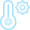 | `ui_img_icon_temp_601_png` | `icon_temp_601.png` | Unselected temperature carousel icon |
| 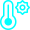 | `ui_img_icon_temp_602_png` | `icon_temp_602.png` | Selected temperature carousel icon |
|  | `ui_img_icon_temp_40_png` | `icon_temp_40.png` | Temperature detail icon |
| 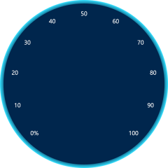 | `ui_img_v2_bj_volume_100_png` | `v2_bj_volume_100.png` | Electrical detail background |
| 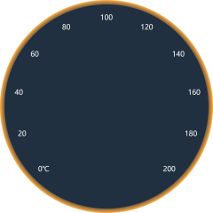 | `ui_img_v2_bj_temp_png` | `v2_bj_temp.png` | Temperature detail background |
| 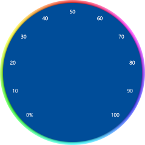 | `ui_img_v2_bj_light_100_png` | `v2_bj_light_100.png` | Brightness detail background |
| 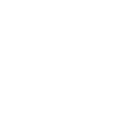 | `ui_img_bar_light_01_png` | `bar_light_01.png` | Brightness bar artwork |
| 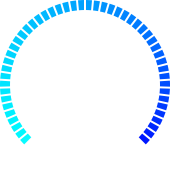 | `ui_img_bar_bule_02_png` | `bar_bule_02.png` | Blue bar artwork; export spelling retained |
| 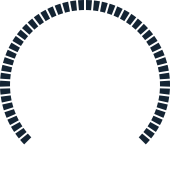 | `ui_img_bar_oven_01_png` | `bar_oven_01.png` | Oven/temperature bar artwork |
| 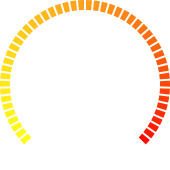 | `ui_img_bar_orange_02_png` | `bar_orange_02.png` | Orange bar artwork |
|  | `ui_img_bar_white_png` | `bar_white.png` | White bar artwork |
| 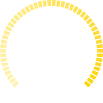 | `ui_img_bar_yellow_02_png` | `bar_yellow_02.png` | Yellow bar artwork |

