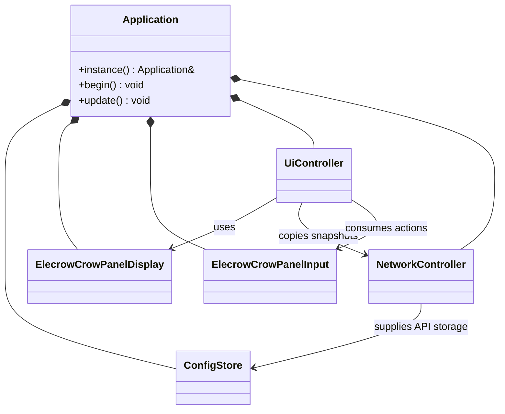

# Object-Oriented Redesign Proposal

## Purpose

Refactor the firmware into a few focused, concrete classes without changing its
hardware behavior, SquareLine assets, MQTT contract, or read-only safety
boundary. The immediate target is to replace mutable globals in `main.cpp`
with explicit object ownership.

Arduino still requires free `setup()` and `loop()` functions. They become
small entry points that delegate to one application object:

```cpp
void setup() {
	rv_control_ui::Application::instance().begin();
}

void loop() {
	rv_control_ui::Application::instance().update();
}
```

## Design Rules

- `Application` is the composition-root singleton and owns the long-lived
  firmware objects.
- `Application` supplies object references to its collaborators. A static
	callback thunk may look up `Application::instance()` only when the framework
	cannot carry an instance pointer.
- `loop()` remains the sole owner of LVGL calls. Input and network tasks queue
  typed events or publish copied snapshots only.
- Board-specific pins, LovyanGFX setup, DMA buffers, and PWM stay outside the
  UI controller.
- Existing fixed-size configuration, catalog, telemetry, and event structs
  remain simple data models rather than artificial classes.

## Proposed Files

| File | Primary type | Responsibility |
| --- | --- | --- |
| `src/application.h/.cpp` | `Application` | Singleton composition root; startup order and each loop pass. |
| `src/elecrow_crowpanel_display.h/.cpp` | `ElecrowCrowPanelDisplay` | Concrete GC9A01, LovyanGFX, SPI2/DMA, PSRAM-buffer, and PWM implementation. |
| `src/elecrow_crowpanel_input.h/.cpp` | `ElecrowCrowPanelInput` | Concrete CST816D touch input, encoder ISR/task, and queued `InputAction` events. |
| `src/ui_controller.h/.cpp` | `UiController` | Carousel state, SquareLine integration, navigation, detail rendering, and display sleep behavior. |
| `src/network_controller.h/.cpp` | `NetworkController` | Existing Wi-Fi, hotspot, MQTT, REST API, status LED, and task-owned snapshot behavior. |

`ConfigStore`, `ConfigApi`, and `StatusLed` already have clear boundaries and
remain separate classes in their existing files. `TelemetryValue`,
`TelemetrySnapshot`, `NetworkStatus`, `CarouselIcon`, and `CarouselItem` stay
with their nearest owning controller unless sharing them reveals a real need
for a small model header.

## Application Ownership



`Application::begin()` will load the configuration, initialize the concrete
display and `UiController`, start the input task, and then start the network
task. Its `update()` method will:

1. Drain queued encoder actions into `UiController`.
2. Copy and forward new telemetry and network-status snapshots.
3. Update display idle/backlight behavior.
4. Call `lv_timer_handler()` and synchronize SquareLine screen changes.

## Concrete Board Components

`ElecrowCrowPanelDisplay` owns the GC9A01 panel driver, LovyanGFX setup, SPI2,
DMA, double PSRAM draw buffers, LVGL display registration, and backlight PWM.
The UI receives a reference to that concrete class. There is no abstract display
interface until the project actually needs to support another board.

LVGL permits a user-data pointer on its display object, so the static flush
callback can retrieve the specific board-display object without a global
forwarding pointer:

```cpp
lv_display_set_user_data(lvglDisplay_, this);
lv_display_set_flush_cb(lvglDisplay_, flushCallback);
```

The flush callback casts that user-data pointer back to
`ElecrowCrowPanelDisplay` and performs the existing DMA transfer.

`ElecrowCrowPanelInput` is separate because its concurrency rules differ from
the display's rules. It owns the CST816D controller, encoder GPIO pins,
button ISR, encoder FreeRTOS task, and `InputAction` queue. Its touch callback
uses the LVGL display registration supplied by `ElecrowCrowPanelDisplay`, but
the input task never accesses LVGL.

## Task and Callback Boundaries

`ElecrowCrowPanelInput` uses static ISR and FreeRTOS task forwarding functions
because those APIs cannot accept member callbacks. They obtain the input object
through `Application::instance()` when required. The input task never calls
LVGL.

`NetworkController` retains its dedicated task. The MQTT C-style callback must
also remain static, but replaces the current `activeNetworkController` global
with a controlled singleton lookup, for example:

```cpp
void NetworkController::messageReceived(char *topic, uint8_t *payload,
											 unsigned int length) {
	Application::instance().network().processMessage(topic, payload, length);
}
```

Only `Application` calls into `UiController`, from Arduino's loop thread. The
network task publishes `TelemetrySnapshot` and `NetworkStatus` through short
critical-section copies. The UI must render Wi-Fi information from
`NetworkStatus`, not call `WiFi` directly; this keeps Wi-Fi ownership entirely
inside the network task.

## Migration Steps

1. Introduce `Application` and reduce `main.cpp` to `setup()` and `loop()`.
2. Extract the concrete `ElecrowCrowPanelDisplay` implementation.
   Preserve the known-good panel, touch, DMA, and backlight initialization
   sequence exactly.
3. Extract `ElecrowCrowPanelInput`, keeping the encoder queue and task
	behavior unchanged.
4. Move carousel, overlay, formatting, screen-navigation, and sleep code into
   `UiController`.
5. Publish a copied `NetworkStatus` from `NetworkController`, remove
	`activeNetworkController`, and have the UI render Wi-Fi data from that copy.
6. Build after every step with `~/.platformio/penv/bin/pio run`.

## Acceptance Criteria

- `main.cpp` contains no mutable firmware state and only Arduino entry points.
- No application-wide mutable pointer or object reference is a file global.
- `Application::instance()` is the sole application-wide object lookup.
- `UiController` has no LovyanGFX, SPI, panel-pin, or direct Wi-Fi dependency.
- The network and input tasks never access LVGL.
- The UI renders copied telemetry and network state and keeps its existing
  carousel, detail screens, brightness control, sleep/wake behavior, and
  SquareLine visual assets.
- A PlatformIO build succeeds after each incremental migration step.